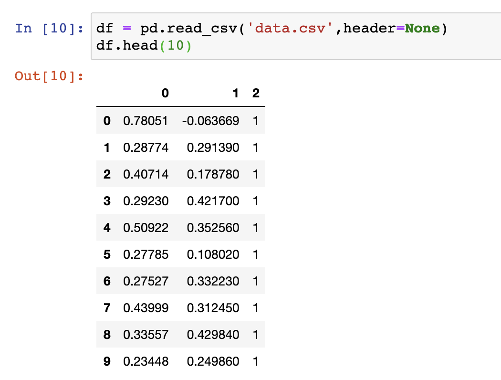
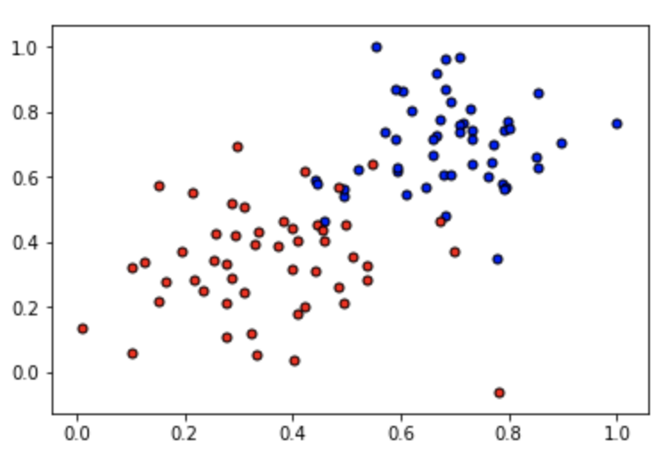
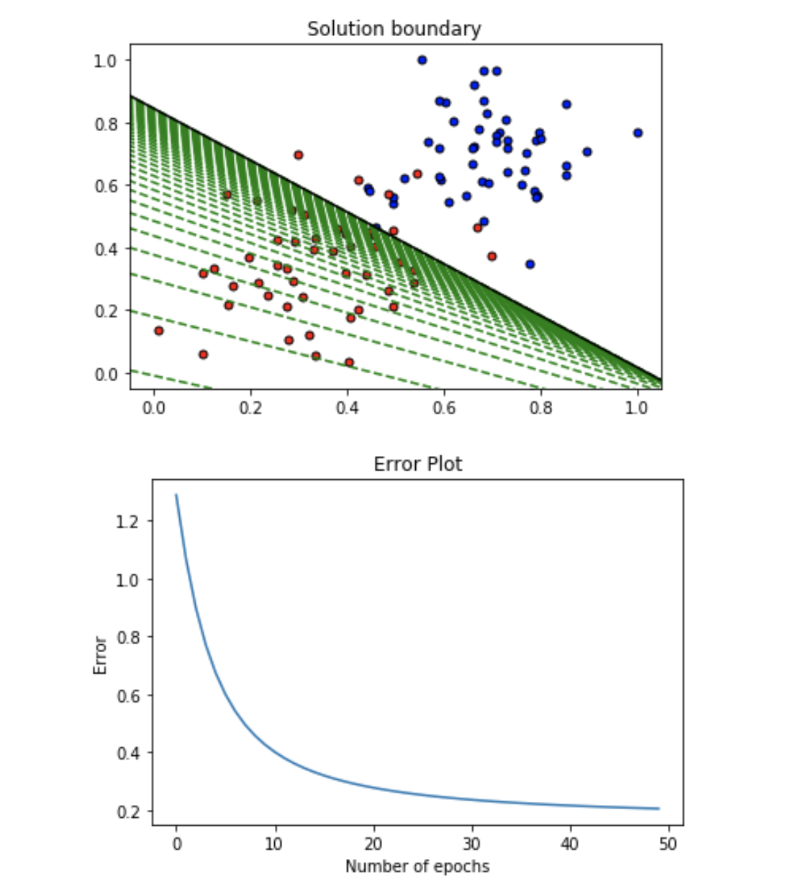

# Gradient-Descent

Gradient Descent is an algorithm by which a function reaches optimal value (maxima or minima). It is preferably used in Neural Network training to tune the weights and bias values of the Perceptrons to efficiently predict the output for the inputs given to the neural network.  
It is used in Machine Learning to optimize a certain value such as the error rate of the prediction.

**Our dataset:**

**The important functions we will be using in the algorithm are:**  

- Sigmoid activation function

$$\sigma(x) = \frac{1}{1+e^{-x}}$$

- Output (prediction) formula

$$\hat{y} = \sigma(w_1 x_1 + w_2 x_2 + b)$$

- Error function

$$Error(y, \hat{y}) = - y \log(\hat{y}) - (1-y) \log(1-\hat{y})$$

- The function that updates the weights

$$ w_i \longrightarrow w_i + \alpha (y - \hat{y}) x_i$$

$$ b \longrightarrow b + \alpha (y - \hat{y})$$

**The neural network is trained for 50 epochs are the output for every 5 epochs are:**  
========== Epoch 0 ==========  
Train loss:  1.2864004732353587  
Accuracy:  0.5  

========== Epoch 5 ==========  
Train loss:  0.6003150295247318  
Accuracy:  0.68  

========== Epoch 10 ==========  
Train loss:  0.40185064357308065  
Accuracy:  0.78  

========== Epoch 15 ==========  
Train loss:  0.3207254855217846  
Accuracy:  0.83  

========== Epoch 20 ==========  
Train loss:  0.2786691329681067  
Accuracy:  0.91  

========== Epoch 25 ==========  
Train loss:  0.25351755638627294  
Accuracy:  0.91  

========== Epoch 30 ==========  
Train loss:  0.23701632123918617  
Accuracy:  0.92  

========== Epoch 35 ==========  
Train loss:  0.22547243011504683  
Accuracy:  0.93  

========== Epoch 40 ==========  
Train loss:  0.21700934395350585  
Accuracy:  0.93  
 
========== Epoch 45 ==========  
Train loss:  0.2105804438631248  
Accuracy:  0.93  

**The output plot is:**

The line drawn in every epoch is marked in the plot. After certain epochs the line converges to an optimal division between the data.